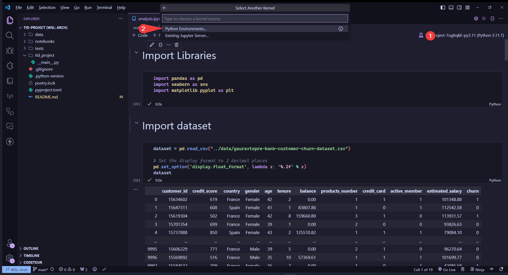
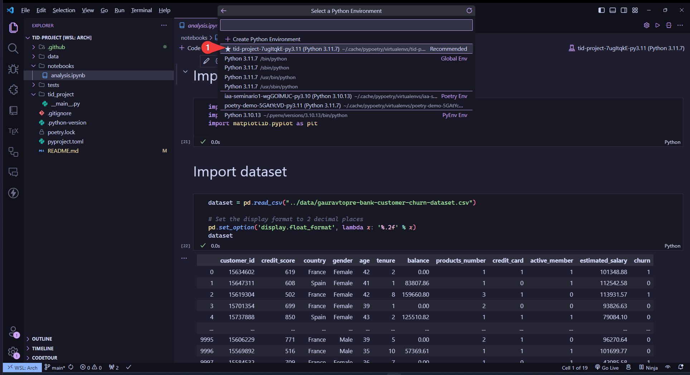

<html>
  <h1 align="center">Solo TID Project</h1>
  <p align="center">Data analysis and classification</p>

  <p align="center">
    <a href="#installation">Installation</a> |
    <a href="#usage">Usage</a> |
    <a href="#contributing">Contributing</a>
  </p>
</html>

<!--  -->

<!-- [](LICENSE) -->

## Installation

### Clone the repository

```bash
git clone git@github.com:Hadronomy/tid-project.git
```

### Install the dependencies

```bash
poetry install
```

> [!NOTE]
> If you don't have poetry installed
> you can install it by following the instructions [here](https://python-poetry.org/docs/).

## Usage

### Open jupyter notebook in VSCode

Install the [Jupyter](https://marketplace.visualstudio.com/items?itemName=ms-toolsai.jupyter) extension in VSCode.

```bash
poetry env use 3.11
```

and then open any `.ipynb` file in vscode and select the python enviroment
for this project.




### Use poetry shell

```bash
poetry shell
```

and then

```bash
python <module>
```

### Poetry `run` command

```bash
poetry run <module>
```

## Contributing

Guidelines on how to contribute to the project.

<!-- ## License

This project is licensed under the [MIT License](LICENSE). -->
